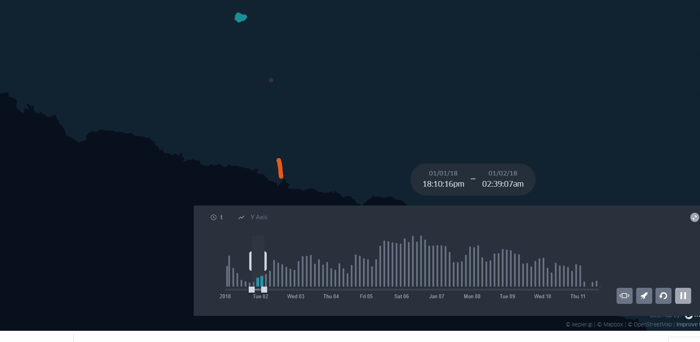
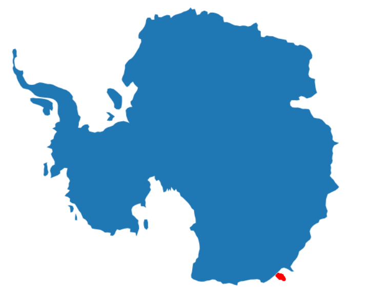
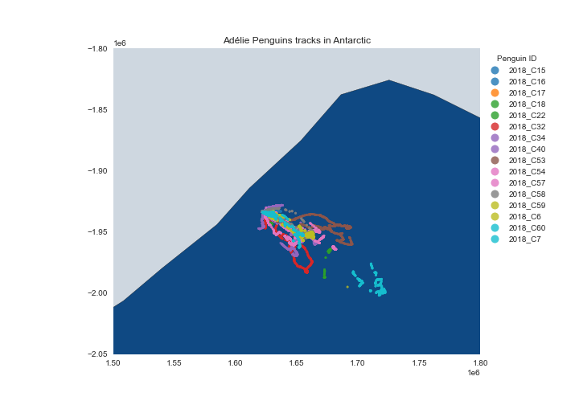

# Summary
This demo contains the foraging behavior of Adélie Penguins in Antactica during chick-rearing period. The tracks were recorded in 2018.

***Final map animation:*** https://bryanvallejo16.github.io/penguin-tracking-antarctica/

***Tutorial:*** https://towardsdatascience.com/orthographic-projection-with-pyproj-for-penguin-tracking-in-antarctica-18cd2bf2d570

# Map animation 

# Orthographic Projection in Antarctica

